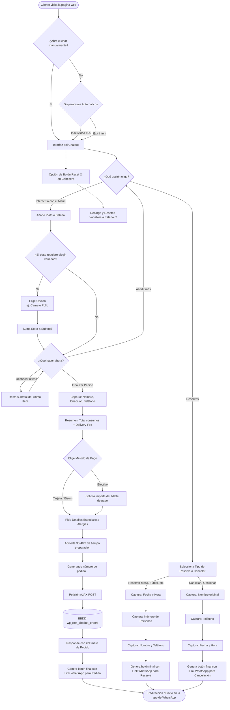

# Documentación: Flujo y Funcionalidad del Chatbot de Restaurante

## 1. Visión General
El plugin para WordPress **"Restaurant Chatbot"** proporciona un asistente virtual integrado en el pie de página de la web diseñado específicamente para hostelería. Permite a los clientes navegar por un menú categorizado, ir formando un pedido, detallar su información de contacto y preferencias, y generar un mensaje final estructurado que se envía directamente al WhatsApp del restaurante. En paralelo, registra todos los pedidos en la base de datos del sitio web y ofrece un panel de administración completo para configurar contenidos y revisar el historial, además de incluir funciones avanzadas para gestionar reservas.

---

## 2. Arquitectura y Componentes Principales

### A. Interfaz y Lógica del Frontend (`chatbot.js` y `chatbot.css`)
- **Carga de interfaz:** Se inyecta la ventana flotante y el botón del logo animado.
- **Cabecera del Chat (Header):** Contiene un botón para Cerrar (✖) la ventana y un **botón para Reiniciar (🧹)** el chat, lo que permite vaciar el pedido en curso y volver al inicio rápidamente tras solicitar confirmación.
- **Menú Dinámico e Interacción:** El chat funciona a través de un árbol de opciones. Las categorías actuales incluyen: *Desayunos*, *Entradas*, *Platos Especiales*, *Comida Rápida y Arepas*, *Combos*, *Bar (Bebidas y Licores)*, *Información / Horarios* y *Reservas*.
- **Cálculo Automático:** Cada vez que el cliente selecciona un plato o bebida, se extrae el precio contenido entre los paréntesis `(X,XX€)` sumando un subtotal automático y permitiendo restar en caso de que el usuario decida eliminar el último elemento añadido.
- **Personalización de Platos:** Para elementos con opciones (ej. tipo de arepa), genera botones dinámicos. Tras elegir, se pueden definir extras o confirmar la adición al pedido.
- **Paso por Caja (Recolección de Información):** Al finalizar el pedido, la lógica captura mediante chat:
    1. Nombre
    2. Dirección (o "Recoger" en el local)
    3. Teléfono de contacto
    4. Elección de Método de Pago (Tarjeta, Bizum, Efectivo solicitando la cantidad de vuelto, o A convenir si no hay configurados).
    5. Detalles especiales (Intolerancias, alergias o ingredientes a quitar).
- **Flujo de Confirmación:** Una vez completada la recogida de datos, se informa al usuario que **el tiempo de preparación y entrega será de 30 a 40 minutos** antes de generar el pedido.
- **Flujo de Reservas / Cancelaciones:** Permite reservar para *Mesa normal*, *Fútbol*, *Cumpleaños* o *Reservado y Eventos*. Captura los detalles (fecha, hora, personas, nombre y teléfono) y de igual forma genera un botón para enviar esta información al WhatsApp. Incluye un flujo inverso para *Gestionar o Cancelar Reserva* (pide nombre, teléfono, fecha y hora).
- **Triggers (Disparadores Automáticos):**
    - *Por Inactividad:* Si tras 15 segundos el usuario no abre el chat, surge de manera proactiva invitando a pedir.
    - *Por Intención de Salida (Exit-Intent):* Si el cursor sale por el área de pestañas del navegador, el bot se despliega intentando retener al usuario.

### B. Backend y Registro en BBDD (`restaurant-chatbot.php`, `ajax-handler.php`)
- **Iniciación:** En la activación del plugin, se crea la tabla `wp_rest_chatbot_orders` para guardar el historial sin depender de WooCommerce.
- **Controlador AJAX (`get_order`):** Momentos antes de enviarlo a WhatsApp, el Frontend manda toda la información (platos, totales, datos) a WordPress vía `POST`.
- **Numeración Secuencial:** El pedido es registrado, recibiendo de vuelta un `Número de Pedido` único o la marca "Pendiente", que será incluida en el mensaje de WhatsApp.

### C. Panel de Administración (`admin-settings.php`)
Dispone de acceso desde los Ajustes de WordPress:
- **Ajustes Generales e Inventario Carta:**
  - **Parámetros Generales:** Número de WhatsApp, Logotipo del Chat (URL del avatar), Coste de Envío a Domicilio y el Folio correlativo del pedido (editable/reseteable).
  - **Métodos de Pago:** Checkboxes para habilitar Tarjeta, Bizum y Efectivo.
  - **Menú Actualizable:** Áreas de texto (Textareas) para gestionar las categorías de Desayunos, Entradas, Platos, Comida, Combos y bebidas del Bar. Sigue el formato `Nombre Plato (Precio) | vars: Opción1, Opción2`.
- **Registro de Pedidos:** Listado en tabla de todas las órdenes, con desglose de ítems, precio, tipo de pago, datos de cliente y timestamp. Permite **exportación a CSV**.

---

## 3. Flujo Paso a Paso desde la Visión del Cliente

1. **Aterrizaje:** El cliente entra en la página web. Visualiza el chat o bien aparece por disparadores automáticos.
2. **Navegación del Menú:** Accede las diferentes categorías de platos o bebidas y conforma su carrito según opciones mostradas tipo botón. Puede revertir el último plato utilizando "Me equivoqué, quitar plato".
3. **Flujo de Reserva (Opcional):** Si en su lugar elige *Reservas*, el flujo cambia interactivamente recabando datos del evento y terminando de inmediato en un botón que lanza el WhatsApp estructurado. 
4. **Completando Pedido de Comida:** Finaliza la carta pulsando *✅ Finalizar y Enviar Pedido*. El asistente le solicitará secuencialmente Nombre, Dirección y Teléfono de contacto.
5. **Decisión de Pago y Preparación:** El chat unifica consumos y coste de entrega indicando el *GRAN TOTAL*. El cliente elige su método de pago. Acto seguido se define cualquier indicación extra (alergias/sin un ingrediente).
6. **Confirmación:** El bot notifica la estimación de 30-40 minutos de espera.
7. **Guardado en BBDD y Número de Folio:** Durante un retardo simulado de `"⏳ Generando número de pedido..."`, se escribe en el backend obteniendo su folio identificador.
8. **Botón Mágico a WhatsApp:** Se muestra al cliente un único botón grande y verde (`📲 Enviar a WhatsApp`) que lleva la macro URL rellena. Al pulsarlo el cliente manda el mensaje desde su propia aplicación móvil o web.

---

## 4. Diagrama de Flujo

