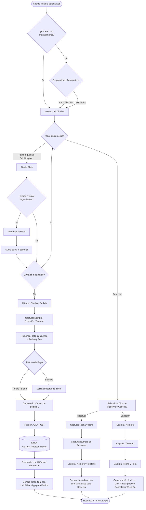

# Documentación: Flujo y Funcionalidad del Chatbot de Restaurante

## 1. Visión General
El plugin para WordPress **"Restaurant Chatbot"**  proporciona un asistente virtual integrado en el pie de página de la web diseñado específicamente para hostelería. Permite a los clientes navegar por un menú categorizado, ir formando un pedido, detallar su información de contacto y preferencias, y generar un mensaje final estructurado que se envía directamente al WhatsApp del restaurante. En paralelo, registra todos los pedidos en la base de datos del sitio web y ofrece un panel de administración completo.
---

## 2. Arquitectura y Componentes Principales

### A. Interfaz y Lógica del Frontend (`chatbot.js` y `chatbot.css`)
- **Carga de interfaz:** Se inyecta la ventana flotante y el botón del logo animado.
- **Menú Dinámico e Interacción:** El chat funciona a través de un árbol de opciones predefinido y de respuesta rápida (Botones para Entrantes, Arepas, Patacones, Platos Combinados, Salchipapas, Hamburguesas, Reservas e Info).
- **Cálculo Automático:** Cada vez que el cliente selecciona un plato, el Javascript extrae el precio contenido entre los paréntesis `(X,XX€)` y suma un subtotal automático.
- **Personalización de Platos:** Después de elegir un plato, el usuario puede de inmediato añadir *extras* o *restar ingredientes* específicos para dicho plato antes de seguir comprando.
- **Paso por Caja (Recolección de Información):** Al proceder a finalizar el pedido, la lógica de JS pasa a un modo conversacional, capturando secuencialmente:
    1. Nombre
    2. Dirección (o preferencia de "Recoger" en local)
    3. Teléfono de contacto
    4. Opciones de método de pago (Tarjeta, Bizum, Efectivo con solicitud de importe de vuelta).
- **Flujo de Reservas / Cancelaciones:** Si el cliente elige reservar (Mesa, Fútbol, Cumpleaños o Eventos), el bot no registra en base de datos; sino que captura día, hora, asistentes, nombre y teléfono, y genera directamente el mensaje para WhatsApp. Igualmente, dispone de una opción para Cancelar/Gestionar capturando Nombre, Teléfono y Fecha/Hora para liberar la mesa.
- **Triggers (Disparadores Automáticos):**
    - *Por Inactividad:* Si tras 15 segundos el usuario no abre el chat, el sistema lo abre de manera proactiva lanzando un mensaje sugerente.
    - *Por Intención de Salida (Exit-Intent):* Si el sistema detecta que el ratón del usuario sale por la parte alta (p.ej., va a cambiar de pestaña o cerrar el navegador), despliega el asistente de inmediato para intentar retenerlo mostrándole un mensaje sobre la carta.

### B. Backend y Registro en BBDD (`restaurant-chatbot.php`, `ajax-handler.php`)
- **Iniciación:** En el momento de activar el plugin, se crea de forma automática la tabla SQL personalizada `wp_rest_chatbot_orders` para guardar un histórico robusto desligado de WooCommerce u otros gestores.
- **Controlador AJAX (`get_order`):** Justo antes de que el usuario envíe su mensaje por WhatsApp, el Javascript envía todos los datos recopilados (platos, totales, info personal) mediante una solicitud en segundo plano (`POST`) al sistema WordPress.
- **Numeración Secuencial:** El script recibe estos datos e inserta la fila en la tabla, calculando un `Número de Pedido` (reseteable cíclicamente o editable desde el admin). Seguido de esto, responde al frontend con un success proporcionando ese último número de folio generado.

### C. Panel de Administración (`admin-settings.php`)
Al administrador le crea un nuevo menú y dos submenús importantes en la zona de Ajustes:
- **Ajustes Generales e Inventario Carta:**
  - **Parámetros Generales:** Número de destino WhatsApp, URL del logo flotante, tarifa de envío a domicilio (`delivery_fee`) y el contador central del pedido que se puede restaurar.
  - **Métodos de Pago:** Sistema de casillas de verificación (checkboxes) para activar/desactivar el pago vía Tarjeta, Bizum o Efectivo.
  - **Menú Actualizable:** Dispone de cajones de texto (Textareas) para todas las categorías (Entrantes, Arepas, Patacones, Platos Combinados, Salchipapas y Hamburguesas), lo cual permite modificar al personal sus precios y platos fácilmente colocando uno por línea (ej: *Salchipapa Junior (5,00€)*).
- **Lista y Registro de Pedidos:**
  - Despliega una tabla visual de cara al administrativo donde se detalla el listado paginado histórico de órdenes que han entrado mediante el chatbot.
  - Incluye un botón para **Exportar a CSV** generando un listado compatible con Excel o importación en caso de auditorías y contabilidad.

---

## 3. Flujo Paso a Paso desde la Visión del Cliente

1. **Aterrizaje:** El cliente entra en la página web y observa el icono o bien sufre la aparición del asistente por uno de los *disparadores*.
2. **Selección del Menú:** Toca los distintos botones (ej. *Hamburguesas*, *Salchipapas*) y va añadiendo lo que le apetece a su carrito invisible del bot.
3. **Extras Personalizados:** Inmediatamente tras seleccionar un plato, el bot ofrece añadir extras (p.ej. extra queso) o quitar ingredientes (p.ej. sin tomate).
4. **Completando Pedido:** Al terminar, presiona el botón *✅ Finalizar y Enviar Pedido*. Responde a las preguntas de contacto (Nombre, dirección, teléfono). 
5. **Resumen y Pagos:** El sistema le consolida sus items + el Fee/Coste de delivery y le otorga el *GRAN TOTAL*. Selecciona si paga de determinada manera (solicitando el importe si es en efectivo).
5. **Guardado en BBDD:** Durante una pausa imperceptible de `"⏳ Generando número de pedido..."`, el plugin se comunica a la web para registrarse por si a futuro hay incidencias y poder auditar que ese pedido llegó, y le asigna el "#Número".
6. **Redirección WhatsApp:** Se le entrega un botón verde que a nivel profundo tiene formateado un texto en negrita y emoticónes (`wa.me/xxx?text=...`).
7. **Fin:** Ya en la aplicación de WhatsApp, el cliente solo pulse enviar. La relación se vuelve 1 a 1 entre él y el personal del restaurante.

---

## 4. Diagrama de Flujo

